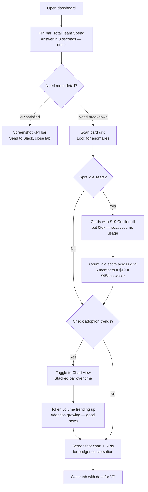
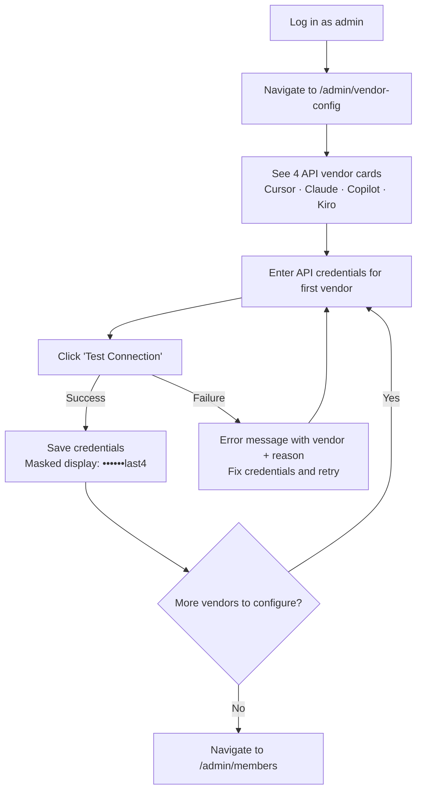
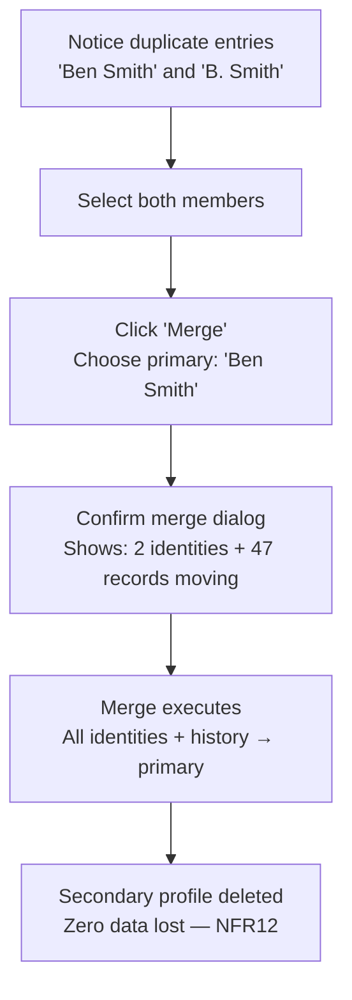
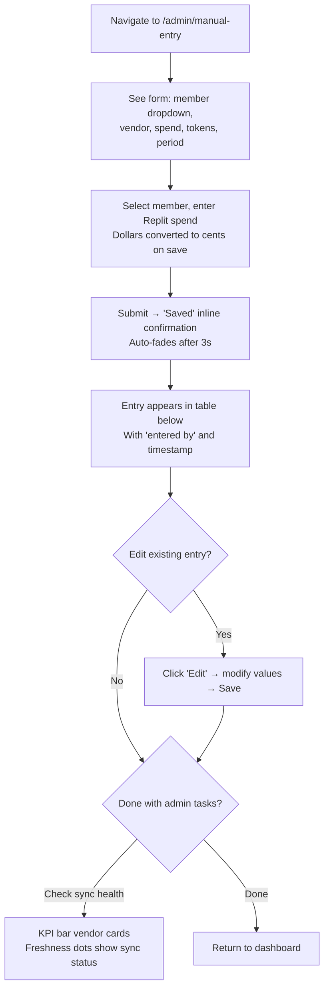

# UX Design Specification ai-spend-dashboard

**Author:** Benjaminsmith
**Date:** 2026-02-25

---

<!-- UX design content will be appended sequentially through collaborative workflow steps -->

## Executive Summary

### Project Vision

AI Spend Dashboard reimagines AI tool spend tracking as a celebration of team adoption. Rather than a cost-control ledger that finance demands you open, this is a product engineers *want* to check — a daily or weekly ritual where you see your rank climb, discover what tools your peers use, and get an LLM-generated moment of delight that's worth screenshotting to Slack.

The core design philosophy: every token burned is human time redeemed. The dashboard exists to make that visible, social, and fun.

**Emotional tone:** Playful startup energy. Think bright, confident, a little cheeky — the kind of product that winks at you. Not corporate dashboards with serif fonts. Not chaotic meme energy either. Polished playfulness.

**Primary context:** Desktop-first, optimized for regular-sized monitors. The core dashboard experience (KPIs, leaderboard, member cards) should be fully visible without vertical scrolling. Mobile is supported but secondary — responsive layout stacks gracefully but isn't the design driver.

**Check-in cadence:** Designed for daily or weekly visits. The experience should reward a quick glance (3-second KPI scan) while offering depth for those who want to explore (card details, suggestion machine, achievements).

### Target Users

**Dana the Engineer (Primary — The Viral Loop)**
Competitive, curious, socially motivated. Dana checks the dashboard to see her rank, browse her peers' tool usage, and generate a suggestion machine output worth sharing. She's the user who screenshots to Slack and drives organic adoption. Design for her delight and the product markets itself.

**Nora the New Hire (Secondary — The Discovery Path)**
Observational, onboarding-mode. Nora uses peer cards as a discovery tool — "wait, three people on my team use Cursor for refactoring?" The dashboard becomes her AI tool onboarding guide without anyone having to write documentation. Empty states must feel like invitations, not failures.

**Mike the Engineering Lead (Secondary — The 3-Second Answer)**
Results-oriented, time-constrained. Mike needs "what's our AI spend this month?" answered instantly via top-line KPIs. He'll scroll through cards to spot idle seats, and use chart view for budget conversations. Design the information hierarchy so his answer is above the fold, always.

**Ben the Admin (Tertiary — The Operator)**
Technical, detail-oriented, low patience for friction. Ben configures API keys, merges member identities across platforms, enters manual Replit data, and monitors sync health. His flows are utility — but they must feel like part of the same product, not an afterthought. If Ben's experience is painful, data quality degrades and the celebration falls apart.

### Key Design Challenges

1. **Information density on a single screen.** ~29 member cards with 4-tool quadrants, spend, tokens, rank, badges, and suggestion machine entry points — all fitting on a regular monitor without scrolling for the core view. Requires aggressive visual hierarchy and progressive disclosure.

2. **Admin UX parity.** The admin experience (API keys, identity merging, manual entry, sync status) must feel cohesive with the celebratory dashboard — not a utility closet behind the party. Admin pain directly impacts data quality.

3. **Empty state design.** New users (Nora) and fresh deployments have sparse data. The celebration framing depends on having something to celebrate — empty states must function as invitations and motivation, not hollow gaps.

4. **Trust calibration.** Data confidence indicators must be visible enough for Mike to trust numbers in a VP conversation, but not so prominent that every card feels like a warning label. Subtle, always-available, never alarming.

### Design Opportunities

1. **The screenshottable moment.** The suggestion machine output should be a self-contained visual artifact — beautiful enough to screenshot, branded enough to be recognizable, sized for Slack/social sharing. This is the product's organic viral loop, designed from pixel one.

2. **Progressive disclosure as architecture.** Three layers: KPI bar + leaderboard (instant scan), member cards with tool quadrants (browsing), suggestion machine + badges + detailed stats (engagement). Each layer serves a different user persona without cluttering the others.

3. **Playful micro-interactions.** Animated growth arrows, badge award moments, the suggestion machine's dramatic "thinking" state with streaming text reveal. These small delights are the difference between a weekly obligation and a daily ritual.

4. **Peer discovery as passive onboarding.** Member cards inherently show which tools each teammate uses — turning a spend tracker into an AI tool adoption guide without any explicit "recommendation" feature.

## Core User Experience

### Defining Experience

The defining experience of AI Spend Dashboard is **the landing moment** — the 2-second scan when you open the dashboard and your brain absorbs three things in rapid succession:

1. **The pulse** — KPI bar tells you the team's current state (total spend, tokens, active members)
2. **The rank** — Your position on the leaderboard, with a green arrow if you've climbed
3. **Your card** — Visually distinct among 29, with your tool quadrants telling your AI story at a glance

This moment is the product's heartbeat. Every design decision flows from making this landing feel *alive* — numbers that feel current, rank that feels earned, and a visual landscape of your team's AI adoption that you can read like a weather map.

**The cards view is the product's home.** 29 member cards in a dense, scannable grid — each one a miniature portrait of that person's AI tool usage. The tool quadrants aren't just data displays; they're visual fingerprints. You glance across the grid and instantly see patterns: who's all-in on Cursor, who's a Claude power user, who hasn't activated Copilot yet. This is the view Dana checks daily, the view Nora learns from, and the view Mike scans for idle seats.

**The chart view is the product's proof.** Horizontal stacked bars showing spend by tool across all members — this is the view Mike screenshots for his VP. It answers "where is our money going?" in the most immediately legible format possible. Each bar is a story: wide Claude segments mean heavy AI coding, thin Copilot slivers mean underutilized seats. The chart view doesn't need to be playful — it needs to be *clear, comparative, and authoritative.*

**The suggestion machine is the product's personality.** It's what makes someone screenshot to Slack. But it lives *within* the card experience — a delightful layer on top of the daily-driver views, not a destination of its own.

If the cards view feels like a spreadsheet, nothing else matters. If the chart view looks amateurish, Mike won't trust it. If both feel alive and clear, the suggestion machine is the cherry on top.

### Platform Strategy

**Desktop-first, browser-based.**

- **Primary:** Desktop browsers on regular-sized monitors (~1920x1080 or 1440p). The core dashboard — KPI bar, leaderboard, and member card grid — must render completely within the viewport without vertical scrolling.
- **Secondary:** Laptop screens (~1366x768). Graceful compression — cards may be smaller, but the three-layer hierarchy (KPIs → leaderboard → cards) remains visible.
- **Tertiary:** Mobile/tablet. Responsive stacking (single column). Functional but not the design target. No one's merging member identities on their phone.
- **Input:** Mouse/keyboard exclusively for design optimization. No touch-specific gestures, drag-and-drop, or swipe interactions required.
- **Offline:** Not needed. This is a live data dashboard — if you're offline, there's nothing to show.
- **Browser features leveraged:** Streaming responses (suggestion machine), smooth CSS transitions (micro-interactions), CSS Grid/Flexbox (card layout density).

### Effortless Interactions

These interactions must require zero cognitive effort:

**Finding yourself.** Your card is visually distinct — highlighted border, subtle background differentiation, or pinned position — so you never scan 29 cards looking for your name. Your eyes land on it instantly. If you're logged in and linked to a member record, the dashboard knows who you are.

**Reading the room via cards.** The card grid communicates team-wide patterns before you read a single number. Dense tool quadrants = active team. Lots of grey quadrants = adoption opportunity. Gold/silver/bronze badges on top cards = healthy competition. The cards view is a *visual heatmap of AI adoption* that reads at a glance.

**Reading spend via chart.** The stacked bar chart communicates relative spend across the team instantly. Long bars = high spenders. Color segments = tool mix. The chart is self-explanatory — no legend-hunting, no axis-label squinting. Someone unfamiliar with the product should understand the chart in 5 seconds.

**Understanding rank movement.** Green up-arrow = you climbed. No arrow = you're steady. That's it. No red, no down, no anxiety. The visual language is binary: celebrating or neutral.

**Toggling views.** Cards ↔ Chart feels like flipping a page. Same data, different lens. No loading spinner, no layout jump. Client-side toggle, instant response (sub-500ms per NFR6).

**Engaging the suggestion machine.** A clear, inviting call-to-action on your own card — not buried, not blaring. You see it, you're curious, you click. The "thinking" animation (streaming text with personality) is the reward for clicking, not a loading penalty.

### Critical Success Moments

**Make-or-break #1: The cards view landing.**
When Dana opens the dashboard and the 29-card grid loads — does it feel like a living team portrait or a data dump? The card grid must communicate patterns visually (tool adoption density, rank distribution, activity levels) before any number is consciously read. This is the view that determines whether people come back tomorrow.

**Make-or-break #2: Mike's chart screenshot.**
The first time Mike opens chart view, takes a screenshot of the stacked bars, and pastes it into a Slack thread with his VP — does it look authoritative and clear, or does it look like a toy? The chart view must earn trust at first glance. Clean axes, professional proportions, clear color differentiation between tools, and no visual clutter.

**Make-or-break #3: The first Slack screenshot (suggestion machine).**
The suggestion machine output must be visually self-contained and beautiful enough that someone's instinct is "I need to share this." If the output is plain text in a gray box, the viral loop dies on arrival. Design the suggestion machine output as a *card within a card* — bounded, branded, screenshottable.

**Make-or-break #4: Nora's discovery moment.**
When Nora sees her peers' cards and realizes "oh, I should be using Cursor too" — the dashboard just did more for AI adoption than any email from IT ever could. Member cards must make tool usage *visible and comparative* without requiring Nora to do any work.

**Make-or-break #5: Ben's first identity merge.**
If Ben can't link "bsmith@assetworks.com" (Claude), "benjamin-smith" (Cursor), and "bsmith" (Copilot) into one person within 30 seconds, he'll dread maintaining this system. The admin flow must surface auto-discovered accounts clearly and make merging feel like connecting puzzle pieces, not filling out forms.

### Experience Principles

1. **Glanceable first, explorable second.** The dashboard's default state communicates the full team picture in a 2-second scan. Detail is always available but never in the way. Design for the scan, then reward the click.

2. **Two views, two jobs.** Cards view is the daily driver — personal, scannable, pattern-rich. Chart view is the proof — comparative, authoritative, presentation-ready. Both are first-class citizens. Neither is a secondary tab.

3. **Celebration is the default state.** Every visual choice — color, motion, language — reinforces that AI spend is good news. Growth arrows go up. Badges reward activity. The suggestion machine turns numbers into joy. There is no "warning" mode for high spend.

4. **You before everyone.** The logged-in user's card, rank, and stats are always visually prioritized. In a grid of 29 people, *your* experience is personalized. This isn't a report about the team — it's a mirror that happens to show the team around you.

5. **Trust is invisible until you need it.** Data confidence indicators exist on every data point but live in the visual background — a subtle icon, a timestamp on hover, a color-coded dot. They never compete with the celebration. But when Mike needs to verify freshness for his VP, the information is one glance away.

6. **The admin is a user too.** Admin flows (API keys, identity linking, manual entry) share the same visual language, component library, and polish as the dashboard. No stark white utility pages. Ben should feel like he's backstage at the same show, not in a different building.

## Desired Emotional Response

### Primary Emotional Goals

**Pride without pressure.** The dominant emotion is pride — in your team's AI adoption, in your own growth, in the tools you've mastered. But it's pride without the anxiety of public comparison. The leaderboard celebrates leaders without exposing laggards. Your rank is your private story; the podium is the team's shared celebration.

**Curiosity that rewards engagement.** Every element invites a closer look. Tool quadrants make you wonder "what's that person using Cursor for?" The suggestion machine makes you wonder "what will it say about my usage?" Badges make you wonder "how do I earn that one?" The product creates micro-curiosity loops that keep people coming back.

**Friendly competition, not survival pressure.** The emotional model is fantasy football, not performance review. You check your stats because it's fun, not because your manager is watching. The top 5-8 podium is a brag board — aspirational, not threatening. Growth arrows celebrate movement; absence of arrows is invisible, not shameful.

### Emotional Journey Mapping

**First visit (Nora):**
Curiosity → Discovery → Aspiration
"What is this?" → "Oh, my teammates all use these tools" → "I should get access to Cursor"
*Design implication: Cards view must make tool adoption patterns immediately visible and comparative. Empty states on Nora's card should feel like an invitation to get started, not a mark of inadequacy.*

**Daily check-in (Dana):**
Anticipation → Recognition → Delight
"Did I climb?" → "I'm in the top 5!" → [clicks suggestion machine] → "I need to screenshot this"
*Design implication: The landing moment must deliver rank status and growth signals within 2 seconds. The suggestion machine must be visually prominent enough to invite the click.*

**Budget conversation (Mike):**
Efficiency → Confidence → Authority
"What's our spend?" → [glances at KPI bar] → "Got it" → [switches to chart view] → [screenshots for VP]
*Design implication: KPI bar must be instant-read. Chart view must look professional enough to paste into a Slack thread with leadership without disclaimer.*

**Admin session (Ben):**
Competence → Flow → Satisfaction
"Time to update Replit data" → [admin panel loads, familiar layout] → "Done in 2 minutes"
*Design implication: Admin flows must feel like a natural extension of the product. Competence comes from consistency — same components, same visual language, predictable interactions.*

**Error encounter (any user):**
Surprise → Calm → Clarity
"Something went wrong" → "Okay, it's not broken" → "Here's what to do"
*Design implication: Errors should have personality (consistent with playful tone) but prioritize calm clarity. Never alarming, never vague. "We couldn't reach Cursor's API — showing data from 3 hours ago" over "Sync Error: ADAPTER_TIMEOUT."*

### Micro-Emotions

**Confidence over confusion.** Every element self-explains. Tool quadrant colors are consistent everywhere. Numbers always have units. The chart needs no legend hunt. A new user should understand the dashboard's purpose within 10 seconds of landing — without reading any help text.

**Belonging over isolation.** The cards view is inherently social — you see yourself among your team. Even at #22, you're *part of the team portrait*. The suggestion machine adds personal flair. Badges create shared vocabulary ("did you get Token Titan yet?"). The product builds in-group identity around AI adoption.

**Delight over mere satisfaction.** The suggestion machine's streaming text reveal, animated growth arrows, badge award moments — these micro-interactions create small emotional peaks throughout the experience. "Satisfied" means people use the tool. "Delighted" means people talk about it.

**Trust over skepticism.** Data confidence indicators are always available but never alarming. Timestamps, sync status dots, source labels — they exist so that when Mike quotes a number to his VP, he's not guessing whether it's fresh. Trust is earned quietly through transparency.

### Leaderboard Emotional Architecture

**A key emotional design decision: the leaderboard is split into three layers with distinct emotional purposes.**

**Public podium (top 5-8, chart view):** Pure celebration. This is the brag board — conference room dashboard material, readable from across a room. Gold/silver/bronze treatment for the top spots. Growth arrows for climbers. Admin-configurable identity display: named ("Dana Martinez"), initialed ("D.M."), or fully anonymous ("#1 — $2,400 across 4 tools"). The toggle lets admins read the team's culture and adjust. Launch anonymous if the team is sensitive; flip to named once people are competing for the spotlight. The anonymity toggle should be easy to find in admin settings — not buried. Most teams will likely graduate from anonymous to named within the first month.

**Private progress (`/my-progress` dedicated page):** Personal growth narrative. Your rank (even #22), your trajectory over time, your badges, your suggestion machine, your tool breakdown. Framed as *your story* — "you climbed 3 spots and earned Multi-Tool Master" — not as your position relative to 28 other people. This is a mirror, not a scoreboard.

**The movable middle (ranks 9-14) gets special attention in the private view:** A visual progress bar showing proximity to the podium — "3 spots from the top 8" with a clear sense of the threshold. This gives the middle of the pack a *target*, not just a position. The people who are most likely to change behavior get the most motivational framing.

**Admin full view:** Matter-of-fact, utilitarian. Complete ranked list of all members, all numbers, no gamification chrome. For Mike's VP conversations, Ben's operational needs, and seat optimization analysis. Always shows full names regardless of the public anonymity toggle.

**Display mode (`?mode=display`):** Phase 2 breadcrumb. The chart view with top 5-8 podium is conference room / wall display material. A simple query parameter that hides nav chrome and uses larger fonts for readability across a room. No auto-cycling — just the bars. Architecture should not block this future addition.

**Why this matters emotionally:** Rank visibility is the highest-anxiety element in any leaderboard product. By limiting public rank display to the top 5-8, making identity configurable, and giving everyone a private progress view with podium-proximity indicators, we get the motivational benefits of competition (aspiration, recognition) without the psychological costs (shame, anxiety, disengagement). The people at the top *want* to be seen. The movable middle has a target to chase. Everyone has badges + suggestion machine as engagement that's independent of rank. Three engagement mechanisms for three emotional zones.

**Precedent:** This pattern is well-established in gaming and fitness (Peloton top riders, Duolingo leagues, GitHub contribution graphs). Applying it to B2B with the admin-controlled anonymity toggle is genuinely novel — most B2B dashboards are either fully transparent or fully private. This configurable middle ground is a differentiator.

**Cards view de-emphasizes rank.** Member cards on the main dashboard do not display rank numbers or growth arrows — those elements live on the chart view podium and the private progress page. Cards are the team portrait: tool quadrants, spend, tokens. The card grid is about *what people use*, not *where they stand*.

### Design Implications

| Desired Emotion | UX Approach |
|---|---|
| Pride | Top 5-8 podium with gold/silver/bronze, growth arrows, badge awards |
| Curiosity | Suggestion machine CTA, peer tool visibility on cards, progressive disclosure |
| Belonging | Team portrait card grid, shared badge vocabulary, social framing |
| Confidence | Self-explaining visuals, consistent color language, instant KPI readability |
| Trust | Subtle sync indicators, source labels, timestamps on hover — never alarming |
| Delight | Streaming text reveal, animated arrows, playful error messages, thinking states |
| Calm (errors) | Friendly language, clear next steps, never vague, personality without panic |
| Aspiration | Public podium shows what "winning" looks like; private progress bar shows how close you are |

### Emotional Design Principles

1. **Celebrate loudly, compare quietly.** Public recognition for leaders. Private progress for everyone. Never publicly rank anyone below the podium.

2. **Personality in every state.** The playful startup energy doesn't disappear when something goes wrong. Error states, empty states, loading states — all carry the product's voice. "Consulting the oracle..." is as much the product as the KPI bar.

3. **Anxiety is a design bug.** If any element of the dashboard makes someone feel bad — about their rank, their spend, their tool adoption — that's a UX failure, not a user failure. Every interaction should leave the user feeling the same or better than before.

4. **Trust is earned in the background.** Data confidence never shouts. It whispers availability: a green dot, a "synced 2h ago" tooltip, a source label. The user who needs it finds it instantly. The user who doesn't never notices it.

5. **The admin controls the emotional temperature.** The anonymity toggle on the public leaderboard gives admins the power to calibrate competitive pressure for their team's culture. This is an emotional design tool, not just a settings toggle.

6. **Give the middle a target.** The movable middle (ranks 9-14) are the users most likely to change behavior. Their private progress view shows podium proximity as a visual progress bar — aspirational framing that turns a static rank into a goal.

## UX Pattern Analysis & Inspiration

### Inspiring Products Analysis

**Spotify Wrapped — The Gold Standard for Data-as-Gift**

Spotify Wrapped takes a year of listening data — fundamentally just play counts and timestamps — and transforms it into a *personal narrative* you can't wait to share. The design lessons are directly transferable:

- **Data framing as celebration.** "You were in the top 3% of Taylor Swift listeners" never feels like a judgment. Low numbers are framed as discovery, not failure. This is exactly the emotional architecture we need for the leaderboard and My Progress view.
- **Visual storytelling over data tables.** Bold colors, large type, one stat per card. Information is sequenced as a *story*, not presented as a spreadsheet. Each card in Wrapped is a self-contained shareable artifact — the exact pattern for our suggestion machine output.
- **Shareability designed in from pixel one.** Every screen is sized and branded for social sharing. The product's viral loop is the product itself. Our suggestion machine output should have this same "designed to be screenshotted" quality — including a subtle product watermark/branding footer so screenshots are recognizable even out of context.
- **Personalization creates emotional investment.** "Your top genre" and "your listening personality" make generic data feel intimate. Our My Progress page should create this same sense of "this is *my* story."
- **Scarcity creates anticipation.** Wrapped is an annual event — you get it once and it feels special. Our suggestion machine should borrow this principle: cache the first generation per member per sync period ("Your February insight is ready"), show the cached version by default, offer a regenerate option. This makes each suggestion feel like *unwrapping* something, not pulling a slot machine lever. Tied to actual data for the period, not random.

**ChatGPT Year in Review — LLM-Native Warmth**

ChatGPT's year-in-review feature (and the general conversational UX of modern LLM tools) provides the tonal north star:

- **Erudite friendliness.** Warm, articulate, slightly delightful. Not corporate, not robotic. Like a smart friend who's genuinely excited about your data. This is the voice for the suggestion machine, error messages, empty states, and all product copy.
- **Encouraging framing at every level.** Low engagement numbers are presented with curiosity ("you explored 3 topics this year") rather than judgment. High numbers get celebration but not in a way that makes low numbers feel inadequate. This maps directly to how we frame rank in the private progress view.
- **Awe over anxiety.** When you see that someone used ChatGPT for 10,000 conversations, the reaction is "wow, that's impressive" not "I'm falling behind." This is the exact emotion we want when someone at #22 sees the top 5 podium — admiration that fuels aspiration, not shame that fuels disengagement.
- **Streaming as experience design.** The token-by-token text reveal isn't a technical limitation — it's a *dramatic device*. The suggestion machine's "Consulting the oracle... Crunching vibes..." thinking state followed by streaming text reveal borrows directly from this pattern.

**Duolingo — Gamification That Motivates Without Punishing**

Duolingo's engagement loop is relevant for our badge and leaderboard systems:

- **League leaderboards with limited visibility.** You compete within a small group, not against all users globally. Our top 5-8 podium follows this principle — bounded competition creates aspiration without overwhelm.
- **Streak-based motivation.** Progress is celebrated as continuity, not just magnitude. Our growth arrows and "climbed 3 spots" framing use the same principle — movement matters as much as position.
- **Badges as vocabulary.** Duolingo's achievements create shared language among users. Our badge set (AI Pioneer, Token Titan, Multi-Tool Master) should similarly become team shorthand — "did you get Token Titan yet?"

**Slack & Linear — Dual-Tone Design Precedents**

These products successfully serve both "fun engagement" and "serious business" from a single design system:

- **Slack:** Playful emoji reactions and GIFs coexist with structured threads and enterprise-grade search. The product feels fun in casual channels and professional in #engineering.
- **Linear:** Beautiful animations and satisfying interactions, but data views are crisp and professional. Never sacrifices clarity for delight.
- **The pattern:** A single design system with two emotional registers. Same components, same fonts, same grid — but applied with different intensity depending on context. This is exactly the model for our warm mode (cards, suggestions, badges) vs. cool mode (chart, admin pages).

### Transferable UX Patterns

**Navigation & Information Hierarchy:**

- **Wrapped's one-stat-per-card sequencing** → Our progressive disclosure architecture. KPIs are the first "card," the card grid is the second, details are the third. Each layer delivers value independently.
- **ChatGPT's conversational tone in UI copy** → Every piece of text in our product should sound like a warm, articulate colleague. Not "Error: sync failed" but "Cursor's API is taking a break — showing data from 3 hours ago."

**Interaction Patterns:**

- **Wrapped's self-contained card format** → The suggestion machine output as a bounded visual artifact — complete in itself, branded for shareability, with a subtle product watermark footer.
- **Duolingo's progress bar toward next league** → Our "3 spots from the podium" progress bar in the private My Progress view. The threshold is visible, the distance is clear, the path forward is obvious.
- **LLM streaming text reveal** → The suggestion machine's thinking state and token-by-token display. Repurposed from ChatGPT/Claude's response pattern as a dramatic reveal moment.
- **Wrapped's scarcity/freshness cadence** → Suggestion machine caches first generation per period. "Your February insight" feels curated, not disposable. Regenerate available but default is the unwrapping moment.

**Visual Patterns:**

- **Wrapped's bold, saturated color palette** → Adopted for warm mode (cards, suggestion machine, badges, My Progress). Playful startup energy demands confident color choices.
- **Linear/Slack's professional restraint** → Adopted for cool mode (chart view, admin pages). Same hues desaturated, clean axes, professional typography. VP-screenshot-ready.
- **Duolingo's celebration animations** → Small moments of motion (growth arrows animating in, badge awards popping) that create emotional peaks without slowing the experience.

### Dual-Tone Design System

**A critical architectural insight from the inspiration analysis: the product needs one design system with two emotional registers.**

**Warm mode** — Cards view, suggestion machine, badges, My Progress page:
- Saturated, bold color palette (Wrapped-inspired)
- Micro-animations on growth arrows, badge awards, suggestion machine reveal
- Playful copy, personality in every element
- The "celebration" register

**Cool mode** — Chart view, admin pages, data tables:
- Same hues, desaturated. Professional proportions.
- No animations. Clean axes, precise typography.
- Clear, direct copy. Authoritative tone.
- The "proof" register

Same components, same fonts, same grid system. Two palettes applied contextually. Mike screenshots the chart view to his VP without disclaimer. Dana screenshots the suggestion machine to Slack with delight. Both feel like the same product.

### Anti-Patterns to Avoid

**AWS Billing Console — The Canonical Anti-Pattern**

AWS billing is everything we are *not* building:

- **Data presented for machines, not humans.** Dense tables with cryptic service names, tiny fonts, zero visual hierarchy. Our dashboard must be readable at a glance — if it takes more than 2 seconds to understand a card, we've failed.
- **Anxiety as the default emotional state.** You open AWS billing because you're scared of surprise charges. Every number feels threatening. Our product inverts this: every number is a celebration of adoption.
- **No personalization.** AWS billing doesn't know or care who you are. It's a ledger. Our dashboard highlights *your* card, *your* rank, *your* suggestion.
- **Ugly by indifference.** Not ugly because of constraints — ugly because visual design was never a priority. Our product's visual polish is a *feature*, not decoration.

**GitHub Copilot Billing — Transactional Without Engagement**

GitHub's own Copilot billing page is clean but purely transactional — seat count, cost per seat, total. Zero engagement, no story, no celebration. We're literally building the emotional engagement layer that GitHub's own dashboard is missing for one of the tools we track. This is both an anti-pattern to avoid and a competitive insight: the vendor dashboards themselves don't make this data engaging. We do.

**Generic Enterprise BI Dashboards (Grafana, Datadog, corporate Tableau)**

- **Configuration-heavy, opinion-free.** These tools make you build your own dashboard. Ours has a strong opinion about what you see first and how.
- **Metric overload.** 47 charts on one page. Our constraint — fit on one monitor, three-layer progressive disclosure — is the antidote.
- **No emotional design.** Numbers exist in a vacuum. No celebration, no narrative, no personality.

**Jira Dashboards**

- **Obligation-driven usage.** Nobody opens Jira dashboards because they want to. Our product must be intrinsically motivating.
- **Visual inconsistency.** Widgets feel designed by different teams in different decades. Our product uses a single design system with consistent visual language everywhere.

### Design Inspiration Strategy

**What to Adopt Directly:**

- Spotify Wrapped's "data as gift" framing → suggestion machine output design, My Progress page narrative
- ChatGPT's erudite-friendly voice → all product copy, error messages, empty states, suggestion machine tone
- Duolingo's bounded leaderboard → top 5-8 public podium
- Duolingo's progress-bar-to-next-level → private "spots from podium" indicator
- LLM streaming text reveal → suggestion machine dramatic reveal
- Wrapped's scarcity cadence → cache first suggestion per period, "unwrapping" moment
- Screenshot branding → subtle product watermark footer on suggestion machine card

**What to Adapt:**

- Wrapped's bold color palette → warm mode for cards/suggestions/badges (playful but professional)
- Wrapped's visual storytelling → adapt for dashboard context (not swipeable stories, but self-contained screenshottable cards)
- Slack/Linear's dual-tone design → one design system, two emotional registers (warm mode + cool mode)
- Duolingo's celebration animations → desktop-appropriate micro-animations (subtle, not full-screen)

**What to Explicitly Avoid:**

- AWS-style dense data tables with no visual hierarchy
- Copilot billing's transactional emptiness — clean but soulless
- Enterprise BI configuration-heavy, opinion-free layouts
- Anxiety-inducing framing of spend data
- Ugly-by-indifference — visual polish is a requirement, not a nice-to-have
- Obligation-driven design where users open because they must, not because they want to
- Metric overload — our "fit on one screen" constraint is sacred
- Visual inconsistency across product surfaces — one design system, always

## Design System Foundation

### Design System Choice

**shadcn/ui** (Radix UI primitives + Tailwind CSS) with **Recharts** for charting — as ratified in the architecture document.

This isn't a traditional "pick a design system" decision — shadcn/ui is already committed. The real decision here is *how we wield it*: the dual-tone strategy, the vendor color system, and the component customization plan.

### Rationale for Selection

- **Copy-paste ownership.** shadcn/ui components live in our codebase, not in `node_modules`. We can customize the suggestion machine card, tool quadrant, and badge components without fighting a library's opinions.
- **Radix accessibility built in.** Dialog, tooltip, dropdown — all WCAG-compliant by default. We get accessible patterns for free and customize visuals on top.
- **Tailwind CSS for dual-tone.** CSS custom properties + Tailwind's theming system makes the warm/cool mode switch trivial — one class toggle on a parent element, zero runtime cost.
- **Recharts alignment.** shadcn/ui's charts page already demonstrates Recharts integration patterns. Stacked horizontal bars, tooltips, legends — all styled to match the system.
- **Community velocity.** Active maintenance, growing component library, strong Next.js ecosystem alignment. Lower long-term risk than a bespoke system.

### Implementation Approach

**CSS Custom Properties for Dual-Tone:**

The warm/cool emotional register is implemented via CSS custom properties with zero runtime JavaScript:

```
:root (warm mode — default)
  --color-primary: saturated, playful values
  --color-surface: warm backgrounds
  --animation-duration: 300ms
  --border-radius: rounded, friendly

.cool-mode (applied on chart view, admin pages)
  --color-primary: desaturated, professional values
  --color-surface: neutral backgrounds
  --animation-duration: 0ms
  --border-radius: tighter, precise
```

A single `.cool-mode` class on a parent container toggles the entire emotional register. Components are mode-agnostic — they reference CSS variables, not hard-coded colors.

**Component Categories:**

| Category | Approach | Examples |
|---|---|---|
| **Use as-is** | shadcn/ui defaults | Button, Dialog, Tooltip, Input, Select, Table |
| **Customize heavily** | shadcn/ui base + custom styling | Card (member cards), Badge (achievement badges), Chart (Recharts wrapper) |
| **Build from scratch** | Custom components on Radix primitives | ToolQuadrant, SuggestionMachineCard, LeaderboardPodium, KPIBar, ProgressBar (podium proximity) |
| **Empty states** | Custom component | EmptyState (invitation-framed, personality-rich, per-context variants) |

### Customization Strategy

**What to use as-is:**
- Form components (Input, Select, Textarea) — admin flows use standard form patterns
- Dialog and Sheet — modal patterns for identity merging, API key management
- Tooltip — data confidence indicators on hover
- Table — admin full-view ranked list

**What to customize heavily:**
- Card — the member card is the product's signature component. shadcn/ui Card provides the base structure; we layer tool quadrant, spend display, badge row, and suggestion machine CTA on top
- Badge — achievement badges need custom sizing, color, and animation (award moment pop)
- Chart containers — Recharts inside shadcn/ui card styling for consistent look

**What to build from scratch:**
- **ToolQuadrant** — flat CSS Grid, no nested Card components. Four-to-five vendor cells showing spend/tokens per tool. This is the visual fingerprint that makes each member card unique. Flat structure keeps the DOM lightweight across 29 cards.
- **SuggestionMachineCard** — bounded, branded output card with streaming text reveal, product watermark footer, screenshot-ready proportions (see detailed visual spec below)
- **LeaderboardPodium** — top 5-8 display with gold/silver/bronze treatment, growth arrows, anonymity-aware rendering
- **KPIBar** — top-of-page horizontal strip with 3-4 key metrics, instant-read typography
- **PodiumProximityBar** — "3 spots from the top 8" visual progress indicator for My Progress page
- **EmptyState** — invitation-framed component with per-context personality. "No Cursor data yet? Your teammates are having all the fun." Not "No data available."

### Vendor Color System

**"Ape the product palettes."** Each vendor's color scheme matches its actual product branding — users should recognize the colors instinctively from the tools they already use daily.

| Vendor | Primary | Accent/Background | Source |
|---|---|---|---|
| **Claude** | Orange (#D97706-range) | White | Anthropic's warm orange brand |
| **Cursor** | White/Light Gray | Dark/Charcoal (#1a1a2e-range) | Cursor's dark IDE aesthetic |
| **GitHub Copilot** | Green (#22c55e-range) | White | GitHub's green identity |
| **Replit** | Orange highlights (#F26522-range) | Dark (#0E1525-range) | Replit's dark UI with orange accents |
| **Kiro** | Purple (#7C3AED-range) | White | Kiro's purple brand identity |

**Implementation:** A single `VENDOR_COLORS` constant exports each vendor's palette (primary, accent, background, text-on-primary). Used everywhere: tool quadrant cells, chart bar segments, legends, card vendor indicators. One source of truth, zero color drift.

**Collision resolution:** Claude and Replit both use orange — but in different registers. Claude is orange-on-white (warm, light); Replit is orange-on-dark (accent in a dark shell). In charts where both appear as bar segments, Claude's orange is warmer/more golden while Replit's is cooler/more red-orange, ensuring visual distinction at a glance.

**Five vendors tracked.** The architecture supports the four original vendors (Cursor, Claude, Copilot, Replit) plus Kiro. The ToolQuadrant component accommodates a 5th vendor — CSS Grid adapts from 2x2 to a layout that includes all five without feeling cramped.

### Development Workflow Additions

**Suggestion machine prototype-first.** The SuggestionMachineCard is the highest-risk, highest-reward custom component. Prototype it in isolation before integrating into member cards — streaming text, branded container, screenshot proportions. Get the screenshottable moment right first, then embed it.

**Dev reference page (`/dev/components`).** A development-only route that renders every custom component (ToolQuadrant, SuggestionMachineCard, EmptyState, etc.) in both warm and cool modes, with all vendor colors visible. Useful during development and design review. Hidden in production behind a dev flag.

## Defining Core Experience

### The Defining Experience

**"See your team's AI world, then discover your place in it."**

If Dana describes AI Spend Dashboard to an engineer at another company, the sentence is: *"It's like Spotify Wrapped for your AI tools, but it updates all the time."*

That sentence captures three things that make this product special:
1. **Data as gift, not ledger.** The Wrapped framing signals celebration, not cost control.
2. **Personal narrative from raw data.** Usage numbers become "your AI story."
3. **Always fresh.** Not an annual event — a living dashboard you check daily or weekly.

The defining interaction is the **landing scan into social discovery**: you open the dashboard and the 29-card grid immediately tells you what your teammates are accomplishing with AI tools. Tool quadrants light up with vendor colors. Dense quadrants signal power users. Sparse ones signal opportunity. You see the team's AI landscape before reading a single number — and that visual pattern recognition is the hook that brings people back.

The personal insight layer (your rank, your suggestions, your badges) is the *reward* for showing up. But the reason you show up is the team portrait.

### User Mental Model

**What users do today:** Frantically scroll vendor billing pages. Chase emailed invoices from one platform, download PDFs from another. Mentally tally spend across Cursor, Claude, Copilot, Replit, and Kiro with no consolidated view. The current experience is fragmented, anxiety-adjacent, and completely devoid of meaning — just raw numbers scattered across five different UIs with five different information architectures.

**The mental model shift:** AI Spend Dashboard doesn't replace "a billing tool" — it replaces *nothing*. There is no consolidated view today. The closest analog is Spotify Wrapped: a product that takes usage data you never thought about and transforms it into a narrative you can't stop sharing. The dashboard creates a category that didn't exist: **team AI adoption as a spectator experience.**

**What this means for design:**
- **Don't mimic billing UIs.** Users aren't expecting line items and invoice numbers. They're expecting something closer to a social feed or a sports scoreboard.
- **The card grid IS the innovation.** No existing tool shows "here's what 29 people are doing with AI, at a glance." This visual density — readable, colorful, pattern-rich — is what makes the product novel.
- **Consolidation alone is valuable.** Even before suggestions, badges, or gamification — simply showing all five vendors in one view, per person, with real colors, solves a problem nobody has solved for this team. Don't bury that value under chrome.

### Success Criteria

**The "worth opening" test:**
A user feels successful when they learn something about their team's AI usage that they didn't know 5 seconds ago. Specific success moments:

1. **"I didn't know Sarah used Kiro that much"** — the card grid reveals peer tool adoption patterns instantly. Success = visual discovery without clicking anything.
2. **"Oh nice, I climbed two spots"** — the private progress view shows personal trajectory. Success = a small dopamine hit from growth, not anxiety from position.
3. **"This suggestion is actually good"** — the suggestion machine output feels personalized and insightful, not generic. Success = the impulse to screenshot.
4. **"Let me show Mike this chart"** — the chart view is clean enough to paste into Slack without disclaimer. Success = Mike trusts the number.

**Speed criteria:**
- Landing scan to pattern recognition: < 2 seconds
- Finding your own card: < 1 second (visual highlighting)
- Cards ↔ Chart toggle: < 500ms (client-side, no loading)
- Suggestion machine first token: < 3 seconds (streaming begins)

**Emotional criteria:**
- No user should feel worse after opening the dashboard than before
- Every empty state should feel like an invitation, not a gap
- Every number should feel like a celebration, not a bill

### Novel vs. Established UX Patterns

**Established patterns we adopt:**
- **Dashboard layout** (KPI bar → content grid → detail panels) — users understand this hierarchy instinctively from any analytics tool
- **Card grid** — familiar from Trello, Pinterest, any card-based UI. Users know cards are scannable, clickable units.
- **Stacked bar chart** — immediately legible to anyone who's seen a chart. No learning curve.
- **Leaderboard/podium** — gaming and fitness UX. Top N with medals. Universal pattern.
- **Streaming text** — ChatGPT/Claude trained everyone to expect and enjoy token-by-token text reveal.

**Novel patterns that make us different:**
- **Tool quadrant as visual fingerprint.** No existing product shows per-person, per-vendor AI spend as a color-coded grid cell within a larger card grid. This is our signature visual — 29 cards with 5 vendor colors each creates a *heatmap of team AI adoption* that's never existed before. The novelty here is density + color + pattern, not interaction.
- **Suggestion machine as "unwrapping" moment.** Cached-per-period LLM output treated as a gift to open, not a button to mash. Combines Wrapped's scarcity with ChatGPT's streaming. Novel combination, familiar individual pieces.
- **Three-layer rank visibility.** Public podium (top 5-8) / private progress / admin full view. This specific layering — configurable anonymity, movable-middle targeting, separate emotional registers per layer — is genuinely novel in B2B dashboards.
- **Dual-tone single design system.** Warm mode for celebration surfaces, cool mode for proof surfaces, toggled by CSS class. The user doesn't choose — context determines register. Same product, two emotional frequencies.

**Teaching strategy for novel patterns:** None needed. Every novel pattern is built from familiar pieces. Tool quadrants are just colored cells in a grid. The suggestion machine is just ChatGPT in a pretty box. Rank layers are just "some things are public, some are private." The innovation is in combination and framing, not in any interaction the user hasn't seen before.

### Experience Mechanics

**The Core Loop: Land → Scan → Discover → Engage**

**1. Initiation — The Landing**
- User opens the dashboard URL (bookmarked, Slack-linked, or direct)
- KPI bar loads first (total spend, total tokens, active members, current period)
- Card grid renders simultaneously — 29 cards with tool quadrants visible
- If logged in and linked to a member record, user's own card is visually highlighted (border treatment, subtle background)
- Leaderboard podium (top 5-8) visible in chart view tab — accessible but not default

**2. Interaction — The Scan**
- Eyes sweep the card grid. Dense, colorful quadrants signal active users. Sparse/grey quadrants signal adoption gaps.
- User locates their own card instantly (visual highlighting). Tool quadrant shows their personal AI fingerprint.
- Cards are clickable for detail expansion — but the grid itself communicates value without any clicks. Zero-click value is the design target.
- Cards ↔ Chart toggle is a persistent, prominent control. One click flips the lens from "team portrait" to "team proof."

**3. Feedback — The Discovery**
- Card grid patterns create "aha" moments: "I didn't know the backend team was heavy on Claude." "Nobody's using Kiro yet."
- Chart view confirms patterns with precision: stacked bars make relative spend obvious across the full team.
- Growth arrows (visible in chart view podium and My Progress) provide personal feedback: you're climbing, you're steady.
- Badge indicators on cards create curiosity: "what's that icon on Marcus's card?"

**4. Completion — The Reward**
- The suggestion machine CTA on the user's own card invites deeper engagement. "Your February insight is ready" (cached per period).
- Clicking reveals the suggestion machine: thinking animation → streaming text → bounded, branded output card.
- The output is the "completion" of the core loop — personalized, screenshottable, shareable.
- The loop resets with the next sync period: new data, new rank movement, new suggestion to unwrap.

**Secondary loops:**
- **My Progress page** (`/my-progress`): Personal rank history, badge collection, podium proximity bar. The "mirror" experience — your story over time.
- **Admin flows**: API keys, identity merging, manual entry, anonymity toggle. Utility loops that maintain data quality for the primary loop.
- **Display mode** (`?mode=display`): Phase 2. Chart view with nav chrome hidden, large fonts. Conference room passive display. Just the bars.

## Visual Design Foundation

### Color System

**Product Palette (non-vendor colors):**

The product's own identity needs to coexist with five vendor colors without competing. The solution: a neutral, warm-gray foundation that lets vendor colors be the stars.

| Role | Warm Mode | Cool Mode | Usage |
|---|---|---|---|
| **Background** | Warm white (#FAFAF8) | Pure white (#FFFFFF) | Page background |
| **Surface** | Soft cream (#F5F4F0) | Light gray (#F8F9FA) | Card backgrounds, panels |
| **Surface elevated** | White (#FFFFFF) | White (#FFFFFF) | Elevated cards, modals |
| **Border** | Warm gray (#E8E5E0) | Cool gray (#E5E7EB) | Card borders, dividers |
| **Text primary** | Near-black (#1A1A1A) | Near-black (#111827) | Headings, key numbers |
| **Text secondary** | Warm gray (#6B6560) | Cool gray (#6B7280) | Labels, descriptions |
| **Text muted** | Light warm gray (#A39E96) | Light cool gray (#9CA3AF) | Timestamps, hints |

**Semantic Colors:**

| Role | Color | Usage |
|---|---|---|
| **Success / Growth** | Green (#22C55E) | Growth arrows, positive indicators, "climbed" states |
| **Neutral / Steady** | Gray (#9CA3AF) | No-change states — invisible, not alarming |
| **Gold** | #EAB308 | 1st place podium, premium badges |
| **Silver** | #94A3B8 | 2nd place podium |
| **Bronze** | #CD7F32 | 3rd place podium |
| **Info / Sync** | Blue (#3B82F6) | Data confidence dots, sync status indicators |
| **Warning** | Amber (#F59E0B) | Stale data alerts (friendly, not alarming) |
| **Destructive** | Red (#EF4444) | Delete confirmations only — never used for spend data |

**Key principle:** Red is never used to indicate high spend. Growth arrows are green or absent — never red/down. The color language reinforces "celebration, not anxiety" at every level.

**Warm ↔ Cool mode transition:** The product background shifts from cream-tinted (#FAFAF8) to pure white (#FFFFFF). Borders shift from warm gray to cool gray. The effect is subtle but perceptible — warm mode feels like a cozy room, cool mode feels like a clean desk. Same furniture, different lighting.

### Typography System

**Primary typeface: Inter**

Inter is the right choice for this product:
- **Legible at small sizes.** 29 cards with spend numbers, tool names, and badge labels require a font that's razor-sharp at 12-14px. Inter was literally designed for computer screens at small sizes.
- **Neutral enough to let vendor colors shine.** Inter doesn't compete for attention — it serves the data.
- **Built-in tabular figures.** Spend numbers ($1,247.50) align perfectly in columns without custom CSS.
- **Friendly without being playful.** The geometric roundness of Inter feels modern and approachable — "erudite friendly" — without tipping into comic or casual territory.
- **shadcn/ui default.** Zero configuration needed. Ships out of the box.

**Type Scale (8px base, major third ratio):**

| Token | Size | Weight | Line Height | Usage |
|---|---|---|---|---|
| **display** | 32px | 700 (Bold) | 1.2 | KPI hero numbers (total spend) |
| **h1** | 24px | 600 (Semibold) | 1.3 | Page titles (Dashboard, My Progress) |
| **h2** | 20px | 600 (Semibold) | 1.35 | Section headers |
| **h3** | 16px | 600 (Semibold) | 1.4 | Card names, subsection titles |
| **body** | 14px | 400 (Regular) | 1.5 | Default text, descriptions |
| **body-sm** | 13px | 400 (Regular) | 1.5 | Card labels, secondary info |
| **caption** | 12px | 500 (Medium) | 1.4 | Timestamps, tool names in quadrants, badge labels |
| **micro** | 11px | 500 (Medium) | 1.3 | Data confidence indicators, sync status |

**Number treatment:** All spend and token figures use tabular (monospace) numerals via `font-variant-numeric: tabular-nums`. Dollar signs and units at caption weight, numbers at body weight. This makes columns of numbers scannable without explicit grid alignment.

**Suggestion machine typography:** The suggestion machine output uses body size (14px) with slightly increased line height (1.6) for readability during streaming. The "thinking" state uses caption italic. The output card title uses h3.

### Spacing & Layout Foundation

**Base unit: 4px**

All spacing derives from a 4px base unit. This creates a tight but consistent rhythm — dense enough for 29 cards, regular enough to feel designed.

| Token | Value | Usage |
|---|---|---|
| **space-1** | 4px | Tight gaps (icon-to-label, badge spacing) |
| **space-2** | 8px | Inner card padding, compact element gaps |
| **space-3** | 12px | Standard element gaps within cards |
| **space-4** | 16px | Card inner padding, section gaps |
| **space-5** | 20px | Gap between cards in grid |
| **space-6** | 24px | Section-level spacing |
| **space-8** | 32px | Major section breaks, page padding |

**Card Grid Layout:**

- **Grid system:** CSS Grid with `auto-fill` and `minmax(220px, 1fr)` — the grid self-adjusts based on viewport width
- **Card minimum width:** 220px (fits name + tool quadrant + spend without cramping)
- **Card maximum width:** ~280px (prevents cards from becoming too wide on large monitors)
- **Grid gap:** 20px (space-5) — enough breathing room to see card edges clearly without wasting density
- **Target:** 5-6 cards per row on 1920px monitors, 4 per row on 1440px, 3 per row on 1366px
- **29 cards at 5 per row = 6 rows** — fits within viewport at reasonable card heights

**Card anatomy (approximate heights):**

| Element | Height | Notes |
|---|---|---|
| Name + avatar row | 36px | Name, avatar/initials, badge icons |
| Tool quadrant (5 vendors) | 80px | 5-cell grid with vendor colors, spend per tool |
| Total spend + tokens | 28px | Headline number + secondary token count |
| Suggestion machine CTA | 28px | "Your insight is ready" link (own card only) |
| **Total card height** | ~180-200px | Fits 6 rows in viewport with KPI bar |

**KPI Bar:** Full-width horizontal strip, 64px tall (space-8 x 2). Fixed at top. Contains 3-4 metrics in a flex row with generous spacing. Always visible regardless of scroll (though the goal is no scroll needed).

**Page layout:**
- Max content width: 1400px, centered
- Side padding: 32px (space-8)
- KPI bar: full-width, 64px
- Cards/Chart toggle: immediately below KPI bar, 40px
- Content area: remaining viewport height for card grid or chart

### Accessibility Considerations

**Contrast ratios:**
- Text primary on surface: >7:1 (AAA)
- Text secondary on surface: >4.5:1 (AA)
- Vendor colors on their respective backgrounds: >4.5:1 (AA) — verified per vendor palette
- Badge labels on badge backgrounds: >4.5:1 (AA)

**Color-blind safety:**
- Vendor colors are distinguishable across protanopia, deuteranopia, and tritanopia. The five vendors span orange, dark, green, dark+orange, and purple — sufficient hue diversity.
- Growth arrows use green + directional shape (arrow up). Never color alone — shape carries the meaning.
- Podium positions use gold/silver/bronze + numeric position labels. Never color alone.
- The Claude/Replit orange collision is further mitigated by context (light vs. dark background) — identifiable even without color distinction.

**Keyboard navigation:**
- All cards are focusable and keyboard-navigable (Radix primitives handle this)
- Cards ↔ Chart toggle accessible via Tab + Enter
- Suggestion machine CTA focusable within own card
- Skip-to-content link for screen readers to bypass KPI bar

**Motion:**
- All warm-mode animations respect `prefers-reduced-motion: reduce` — animations become instant transitions
- Cool mode has no animations by default (0ms duration)
- Streaming text in suggestion machine remains functional but skips the typewriter effect when reduced motion is preferred

## Design Direction Decision

### Design Directions Explored

Four directions were generated as interactive HTML mockups (see `ux-design-directions.html`):

| Direction | Name | Character | Key Traits |
|---|---|---|---|
| A | Warm Gallery | Approachable, light, editorial | Cream canvas `#EDEAE4`, white cards, circle avatars, text-link CTAs, flat KPI bar |
| B | Dense Heatmap | Data-forward, compact, utilitarian | Light warm bg, smaller cards, data tables inside cards, mini-chart sparklines |
| C | Clean Studio | Minimal, airy, design-centric | Near-white bg, generous whitespace, thin hairline borders, typographic hierarchy |
| D | Bold Energy | Vibrant, playful, high-contrast | Warm sand bg `#E8E4DE`, gradient dark→purple KPI bar, rounded-square avatars, hover lifts, gradient pill CTAs |

A second round refined **A2** and **D2** with stakeholder feedback:
- Deeper page backgrounds for a clear 3-layer contrast hierarchy (page → card → tool pill)
- Vendor-colored borders on tool pills for stronger differentiation
- Both **spend** and **token usage** displayed in each tool pill (e.g. "$420 · 75K tok")
- Enhanced "you" highlight with outer glow and warm background tint

### Chosen Direction

**Direction A2+D2 Hybrid — Warm Gallery with Dark KPI Bar**

The warm cream gallery aesthetic with clean white cards on a `#EDEAE4` page background, combined with D2's dark gradient KPI bar for a strong visual anchor at the top of the page. This hybrid embodies the "Spotify Wrapped for AI tools" personality — inviting, editorial, and social — with a bold header that grounds the page and frames the metrics.

**Key visual properties:**
- **Page background:** `#EDEAE4` warm cream
- **Card background:** `#FFFFFF` white with subtle shadow
- **Card radius:** `12px`
- **Avatar style:** Circle
- **KPI bar:** Dark-to-purple gradient (`#1a1a2e` → `#6C63FF`), white text, bold metric numbers — borrowed from D2
- **Tool pills:** Vendor-colored border + icon, showing `$spend · Xtok`
- **CTA style:** Text link ("View suggestions →"), warm accent color
- **"You" highlight:** Warm tint background + outer glow + "You" badge
- **Hover:** Subtle shadow lift (no dramatic transform)
- **Overall density:** Comfortable — generous padding, scannable grid

### Design Rationale

1. **Brand alignment:** The warm gallery feel matches the product's dual personality — social and playful in warm mode, professional and clean in cool mode. Direction A2's restraint leaves room for the warm/cool toggle to create meaningful contrast.
2. **Scalability:** The clean card structure accommodates the full information hierarchy (avatar, name, total spend, tool pills with spend+tokens, growth indicator, badges) without feeling cluttered at 12+ members.
3. **Accessibility:** High contrast between the three layers (cream page → white card → bordered pill) ensures readability. The circle avatar and text-link CTA are familiar, low-cognitive-load patterns.
4. **Best of both worlds:** A2's calm card grid gives warm-mode animations room to shine, while D2's dark gradient KPI bar provides a bold, grounding header that instantly communicates "this is the dashboard" and creates strong visual hierarchy against the cream page.
5. **Tool pill clarity:** Vendor-colored borders on a white card background make the 5-vendor breakdown instantly scannable. Adding tokens alongside spend gives users the full cost picture at a glance.

### Implementation Approach

**CSS custom properties (design tokens):**
```
--page-bg: #EDEAE4;
--card-bg: #FFFFFF;
--card-radius: 12px;
--card-shadow: 0 1px 3px rgba(0,0,0,0.08);
--card-shadow-hover: 0 4px 12px rgba(0,0,0,0.12);
--kpi-bar-bg: linear-gradient(135deg, #1a1a2e 0%, #6C63FF 100%);
--kpi-bar-text: #FFFFFF;
--highlight-bg: rgba(255, 165, 0, 0.06);
--highlight-glow: 0 0 20px rgba(255, 165, 0, 0.15);
--pill-radius: 6px;
--avatar-size: 48px;
--avatar-radius: 50%;
```

**Warm/cool mode toggle:** A2 serves as the warm-mode foundation. Cool mode desaturates the page background toward neutral gray, removes card hover shadows, and swaps the KPI bar to a flat slate header — all via CSS custom property overrides on a `.cool-mode` class.

**Card grid:** `display: grid; grid-template-columns: repeat(auto-fill, minmax(220px, 1fr)); gap: 16px;` — responsive without breakpoints, cards reflow naturally.

**Tool pill pattern:** Each pill is a flex row: `[vendor-icon] [vendor-name] [$spend · Xtok]` with a 1px border in the vendor's brand color. Pill layout wraps inside the card when 5 vendors are present.

## User Journey Flows

### Journey 1: "Where Do I Rank?" (Dana — Returning Engineer)

**Entry:** Dana opens the dashboard URL (bookmarked or Slack link). She's already authenticated.

**Flow:**

```mermaid
flowchart TD
    A[Land on Dashboard] --> B[KPI bar loads instantly\nTotal Spend · Total Tokens · Active Members]
    B --> C[Card grid renders below\nRanked by spend, highest first]
    C --> D{Scan for own card}
    D -->|Spot "You" highlight + glow| E[Read own rank + growth arrow\n#4 ▲ from last period]
    E --> F[Scan tool pills on own card\nCursor $420·75K tok / Claude $180·32K tok / Copilot $19·0tok]
    F --> G[Read suggestion machine snippet\nHumorous LLM-generated insight]
    G --> H{Want more detail?}
    H -->|Yes| I[Tap card → expand or\n"View suggestions →" CTA]
    I --> J[Full suggestion machine view\nPersonalized insights + badge progress]
    H -->|No| K{Curious about team trends?}
    K -->|Yes| L[Toggle Cards → Chart view\nStacked bar comparison across team]
    L --> M[Scan trends, screenshot for Slack]
    K -->|No| N[Close tab, satisfied]
    J --> N
    M --> N
```

**Key UX moments:**
- **Instant orientation (< 1s):** KPI bar answers "how's the team doing" before scrolling
- **Self-location (< 3s):** "You" highlight + glow makes own card unmissable in the grid
- **Social proof:** Seeing peers' tool breakdowns sparks comparison and conversation
- **Shareability:** Suggestion machine snippet is screenshot-worthy by design

### Journey 2: "Wait, We Have Four AI Tools?" (Nora — New Hire)

**Entry:** Nora's manager mentions the dashboard in a 1:1. She receives a login link, creates her account.

**Flow:**

```mermaid
flowchart TD
    A[First login → lands on cards view] --> B[KPI bar: sees team totals\nEstablishes context for scale]
    B --> C[Card grid loads\nNora's card near bottom — low spend]
    C --> D[No down-arrow on her card\nNeutral position, no shame signal]
    D --> E{Scan peers' cards above}
    E --> F[Notice: peers have 3-4 lit tool pills\nNora only has Copilot]
    F --> G[Discovery moment:\n"The team uses Cursor and Claude too"]
    G --> H{Internal motivation triggered}
    H --> I[Asks team lead about\ngetting Cursor/Claude access]
    I --> J[... time passes, next sync period ...]
    J --> K[Return visit: Cursor pill appears on card\nGreen ▲ growth arrow]
    K --> L[Badge earned: "AI Pioneer"\nFirst new tool adoption]
    L --> M[Card now shows 2 tool pills\nProgress visible to self and peers]
```

**Key UX moments:**
- **No negative signals:** Growth-only arrows mean new hires see neutral, never "you're behind"
- **Peer learning through observation:** Tool pill visibility on others' cards teaches what's available
- **Progress is visible:** Adding a tool pill + earning a badge = tangible reward loop
- **The dashboard teaches without onboarding:** Card structure itself communicates what tools exist

### Journey 3: "What Are We Spending?" (Mike — Engineering Lead)

**Entry:** VP asks "what's our AI bill?" in Slack. Mike opens the dashboard.

**Flow:**



**Key UX moments:**
- **3-second answer:** KPI bar is designed for exactly this scenario — glanceable, no drilling
- **Idle seat detection:** $19 pill with 0tok is a clear signal without needing a special report
- **Chart view as proof:** Stacked bars show trends over time for executive storytelling
- **Screenshot-ready layout:** KPI bar + chart are designed to look good in Slack/email paste

### Journey 4: "Keeping the Lights On" (Ben — Dashboard Admin)

**Entry:** Ben is setting up the dashboard for the first time, or returning to link newly discovered vendor accounts and update manual data.

**Flow — Initial Setup:**



**Flow — Identity Linking:**

```mermaid
flowchart TD
    I[/admin/members page loads] --> J[See 'Unlinked Accounts' section\nAuto-discovered from vendor sync]
    J --> K{Accounts with 'Possible match' flag?}
    K -->|Yes| L[Review: 'bsmith@assetworks.com' from Claude\nmatches existing member 'Ben Smith']
    L --> M[Click 'Link to Existing Member'\nSelect 'Ben Smith' from dropdown]
    M --> N[Confirm link\nAll matching usage_records updated]
    K -->|No| O[Click 'Create New Member'\nPre-filled from vendor account data]
    O --> N
    N --> P{More unlinked accounts?}
    P -->|Yes| J
    P -->|No| Q[Member list shows linked count per member\n'Ben Smith — 3 vendors linked']
```

**Flow — Merge Duplicate Members:**



**Flow — Manual Data Entry (Replit):**



**Key UX moments:**
- **Progressive setup:** Vendor config → auto-discovery → identity linking → manual entry. Each step builds on the last.
- **30-second identity linking goal:** Click 'Link to Existing Member', select from dropdown, done. No form filling.
- **Merge is safe:** Confirmation dialog shows exactly what will move. Zero-data-loss guarantee visible to the admin.
- **Admin pages in cool mode:** Desaturated, no animation, matter-of-fact. Admin work is operational, not celebratory.
- **Freshness monitoring at a glance:** Vendor cards in KPI bar with colored dots — green/amber/red/gray — are the single sync health dashboard.

### Journey Patterns

**Cross-journey patterns extracted:**

| Pattern | Description | Used In |
|---|---|---|
| **KPI-first orientation** | Top bar answers the broadest question before any interaction | All four |
| **Self-location via highlight** | "You" glow eliminates search time in the grid | Dana, Nora |
| **Tool pill as information unit** | `[icon] [name] [$spend · Xtok]` is the atomic data element | All three |
| **Growth-only indicators** | Green ▲ for improvement, neutral for stable, no red ▼ | Dana, Nora |
| **Cards ↔ Chart toggle** | Two views of the same data, different questions answered | Dana, Mike |
| **Screenshot-worthy layouts** | KPI bar, cards, and chart all render cleanly when captured | Dana, Mike |
| **Progressive disclosure** | KPI bar → card grid → expanded card/suggestions → chart | All three |

### Flow Optimization Principles

1. **Zero-click value:** The dashboard delivers its primary answer (team spend, your rank, peer activity) on page load with no interaction required
2. **One-toggle depth:** Cards ↔ Chart is the only navigation decision on the main view — no menus, no tabs, no dropdowns
3. **Scan > Search:** Card grid is ranked and highlighted so users scan visually rather than searching by name
4. **No dead ends:** Every view has a clear next action — card → suggestions CTA, chart → time range, KPI → scroll down
5. **Emotional safety:** No negative indicators, no "you're behind" messaging — growth arrows only go up or stay neutral

## Component Strategy

### Design System Components (shadcn/ui)

**Direct use — no customization needed:**

| Component | Usage |
|---|---|
| `Button` | Cards ↔ Chart toggle, admin actions |
| `Toggle` | Warm/cool mode switch |
| `Badge` | Achievement badges on cards, rank indicators |
| `Tooltip` | Vendor pill hover details, KPI explanations |
| `Avatar` | Circle member photos in cards |
| `Card` | Base primitive for member cards (heavily extended) |
| `Dialog` | Confirmation dialogs in admin flows |
| `Input` / `Label` | Admin forms (API keys, manual entry) |
| `Table` | Admin member management list |
| `Tabs` | Cards ↔ Chart view toggle (accessible keyboard nav built in) |
| `Skeleton` | Loading states for cards and KPI bar during data fetch |

**Minor customization needed:**

| Component | Customization |
|---|---|
| `Card` | Extended with warm-mode glow, "You" highlight, vendor pill grid |
| `Badge` | Custom color variants per achievement type |
| `Tabs` | Styled to match dark KPI bar when used as view toggle |

### Custom Components

#### 1. KPI Bar (`<KpiBar />`)

**Purpose:** Instant team-level answers — total spend, total tokens, active members, period selector
**Anatomy:**
- Dark gradient container (`#1a1a2e` → `#6C63FF`)
- 3-4 metric slots, each: label (sm, white/70%) + value (2xl, white, bold) + trend arrow
- Period selector at right edge (dropdown or segmented control)
- Full-width, sticky top on scroll

**States:** Loading (skeleton pulse on dark bg), populated, error (fallback to last-known values with staleness indicator)
**Accessibility:** Each metric is a `<dl>` with `<dt>` label and `<dd>` value. Period selector is keyboard-navigable.

#### 2. Member Card (`<MemberCard />`)

**Purpose:** The atomic unit of the dashboard — one person's AI spend story at a glance
**Anatomy:**
- Avatar (circle, 48px) + name + rank badge
- Total spend (bold) + growth arrow (▲ green or — neutral)
- Tool pill row (wrapping flex): 1-5 vendor pills
- Suggestion snippet (1 line, truncated) + "View suggestions →" CTA

**Variants:**
- `default` — standard card
- `highlighted` — "You" card with warm tint bg `rgba(255,165,0,0.06)`, outer glow, "You" badge
- `podium` — top 3 cards with gold/silver/bronze accent border

**States:** Loading (skeleton), populated, hover (subtle shadow lift), focused (keyboard outline)
**Accessibility:** Each card is an `<article>` with `aria-label="[Name], rank [N], [spend]"`. CTA is a focusable link. Growth arrow has `aria-label="up from last period"` or `"no change"`.

#### 3. Tool Pill (`<ToolPill />`)

**Purpose:** Show per-vendor spend + tokens in a compact, scannable unit
**Anatomy:** `[vendor-icon 16px] [vendor-name] [$spend · Xtok]` — 1px border in vendor brand color, `6px` radius
**Variants:** One per vendor (Cursor, Claude, Copilot, Replit, Kiro) — each with its own border color from `VENDOR_COLORS`
**States:** Default, hover (tooltip with full spend breakdown), zero-usage (muted text, `$19 · 0tok` for seat-only cost)
**Accessibility:** `role="listitem"` within a `role="list"` on the pill container. Tooltip on hover/focus.

#### 4. Growth Arrow (`<GrowthArrow />`)

**Purpose:** Show rank movement since last period — growth only, no shame
**Variants:**
- `up` — green ▲ with `aria-label="moved up"`
- `neutral` — gray — with `aria-label="no change"`
- `new` — blue dot with `aria-label="new member"`

**No "down" variant.** If rank dropped, show neutral. Emotional safety by design.

#### 5. Suggestion Snippet (`<SuggestionSnippet />`)

**Purpose:** Teaser of the LLM-generated suggestion on the member card
**Anatomy:** Single line of text, truncated with ellipsis, warm accent color for the "View suggestions →" link
**States:** Loading (shimmer animation in warm mode, static skeleton in cool mode), populated, empty ("No suggestions yet")
**Accessibility:** Text is readable by screen readers. CTA link navigates to `/my-progress`.

#### 6. Suggestion Machine Card (`<SuggestionMachineCard />`)

**Purpose:** The screenshottable, shareable output card for LLM-generated suggestions. This is the product's viral loop — if this card isn't beautiful and self-contained, the organic Slack sharing loop dies. Highest-risk, highest-reward custom component.

**Anatomy (card-within-a-card):**
```
┌─────────────────────────────────────────┐
│  ┌───────────────────────────────────┐  │
│  │  ✨ Your February Insight          │  │
│  │                                   │  │
│  │  "With 14 hours of AI-assisted    │  │
│  │   work this month, you could      │  │
│  │   have hand-knitted a scarf for   │  │
│  │   every member of a mid-sized     │  │
│  │   jazz ensemble."                 │  │
│  │                                   │  │
│  │  ─────────────────────────────    │  │
│  │  AI Spend Dashboard · Feb 2026    │  │
│  │  [Regenerate ↻]                   │  │
│  └───────────────────────────────────┘  │
└─────────────────────────────────────────┘
```

**Visual spec:**
- **Outer container:** The parent context (member card or /my-progress section)
- **Inner card (the screenshottable artifact):**
  - Background: warm gradient — `linear-gradient(135deg, #FFFBF0, #FFF5E6)` (cream to soft amber)
  - Border: 1px solid `#E8DFD0` (warm stone)
  - Border-radius: 12px (slightly more rounded than standard cards for premium feel)
  - Padding: 24px
  - Max-width: 480px (optimized for Slack preview and social share)
  - Min-height: 160px (prevents overly compressed cards on short suggestions)

**Typography within the card:**
- **Title:** "Your [Month] Insight" — h3, 16px semibold, `#1A1A1A`
- **Sparkle icon:** ✨ emoji before title (not an icon component — simple unicode)
- **Body text:** 14px regular, `#374151`, line-height 1.6, slightly increased letter-spacing (0.01em) for readability during streaming
- **Separator:** 1px solid `#E8DFD0`, margin 16px 0
- **Watermark footer:** "AI Spend Dashboard · [Month Year]" — 11px, `#A39E96` (muted), font-style italic
- **Regenerate link:** "Regenerate ↻" — 12px, `#D97706` (warm accent), positioned below watermark, right-aligned

**Thinking state (streaming pre-phase):**
- Placeholder text cycles through personality-rich copy with 1.5s intervals:
  - "Consulting the oracle..."
  - "Crunching vibes..."
  - "Calculating your time-savings in obscure units..."
  - "Asking the AI what you could do with all that time..."
- Text renders in caption italic (12px, `#A39E96`)
- Subtle pulse animation on the card border (warm glow expanding/contracting)
- Duration: typically 1-3s before streaming begins

**Streaming state:**
- Body text area switches from thinking copy to token-by-token text reveal
- New tokens append with a soft fade-in (opacity 0→1 over 100ms per token group)
- Cursor: blinking `|` character at the end of the last token (warm accent color)
- No scroll — card height grows to accommodate text (up to a max of ~8 lines, after which text wraps normally)

**Completed state:**
- Blinking cursor removed
- Full suggestion text displayed
- Watermark footer and regenerate link fade in (opacity 0→1 over 300ms)
- Card is now "screenshot-ready" — all elements in final position

**Screenshot-ready design principles:**
- Card must look complete and self-contained when captured — no dependent elements outside the border
- Watermark footer makes screenshots recognizable in Slack/social without additional context
- 480px max-width fits cleanly in Slack message previews and social media cards
- White-space ratio: ~30% padding to content ensures the card breathes

**Accessibility:**
- `role="region"` with `aria-label="Your personalized AI usage insight"`
- Thinking state: `aria-live="polite"` so screen readers announce phase changes
- Streaming text: `aria-live="polite"` with `aria-atomic="false"` so only new text is announced
- Regenerate button: `aria-label="Generate a new suggestion for this month"`
- `prefers-reduced-motion`: Skip typewriter animation, render text instantly. Skip thinking pulse animation. Watermark/regenerate appear instantly without fade.

#### 7. Chart View (`<SpendChart />`)

**Purpose:** Stacked bar chart showing team spend over time, broken down by vendor
**Built on:** Recharts `<BarChart>` with `<Bar>` per vendor using `VENDOR_COLORS`
**Anatomy:** X-axis (time periods), Y-axis (spend $), stacked bars, legend, hover tooltip with exact values
**States:** Loading (skeleton bars), populated, empty period (gap in bars), hover (tooltip)
**Accessibility:** Chart has `role="img"` with `aria-label` summarizing the trend. Data table available as screen-reader alternative via visually hidden `<table>`.

### Component Implementation Strategy

**Token-based styling:** All custom components consume CSS custom properties from the design direction (Step 9) — `--page-bg`, `--card-bg`, `--card-radius`, `--kpi-bar-bg`, etc. Warm/cool mode swaps tokens on a root class toggle.

**Composition over configuration:** `MemberCard` composes `Avatar`, `ToolPill`, `GrowthArrow`, `Badge`, and `SuggestionSnippet` rather than accepting dozens of props. Each sub-component is independently testable.

**Server vs. client components (Next.js):**
- `KpiBar`, `MemberCard`, `ToolPill`, `GrowthArrow`, `Badge` — **Server Components** (static render from DB data, no client interactivity)
- `SpendChart` — **Client Component** (Recharts requires browser APIs)
- `SuggestionSnippet` — **Server Component** with client CTA link
- Cards ↔ Chart `Tabs` toggle — **Client Component** (manages view state)

### Implementation Roadmap

**Phase 1 — Core (MVP launch):**
- `KpiBar` — needed for all three journeys (instant team metrics)
- `MemberCard` + `ToolPill` + `GrowthArrow` — the product's home
- `Tabs` toggle (Cards ↔ Chart)
- `SpendChart` — Mike's journey, trend visualization

**Phase 2 — Engagement:**
- `SuggestionSnippet` + `/my-progress` page — Dana's journey, suggestion machine
- Achievement `Badge` variants — Nora's journey, reward loop
- Warm/cool mode user-accessible toggle (Phase 2 — MVP uses context-automatic switching only)

**Phase 3 — Polish:**
- Podium variant for top-3 cards
- Skeleton loading states for all components
- `prefers-reduced-motion` animation fallbacks
- Chart data table for screen reader accessibility

## UX Consistency Patterns

### Data Freshness

**Freshness lives on vendor total cards in the KPI bar — nowhere else.** Member cards show no staleness indicators; the per-vendor freshness dot in the KPI bar is the single source of truth.

| State | Dot Color | Label | Threshold |
|---|---|---|---|
| Fresh | Green `#4ade80` | Time since sync (e.g. "2h") | < 6 hours |
| Stale | Amber `#fbbf24` | Time since sync (e.g. "18h") | 6–24 hours |
| Old | Red `#f87171` | Time since sync (e.g. "3d") | > 24 hours |
| Manual | Gray `#a8a29e` | "5d" (days since manual entry) | No API — manual only |

**Hover behavior:** Vendor card tooltip shows full detail — "Last synced Feb 26 at 2:14 PM" or "Manual entry by Ben Smith on Feb 21".

### Loading States

| Component | Loading Pattern |
|---|---|
| KPI bar hero metrics | Skeleton pulse (light shimmer on dark bg) |
| Vendor total cards | Skeleton pulse matching card shape |
| Member cards | Full skeleton card (avatar circle + 3 text lines + tool cell placeholders) |
| Chart view | Skeleton bar outlines with pulsing fill |

**Rule:** Skeleton shapes match the exact dimensions of populated content. No spinners, no "Loading..." text. Content appears in place.

### Empty States

| Scenario | Display |
|---|---|
| No data for current period | KPI bar shows "$0" / "0" / "0/29" with muted text. Card grid shows a centered message: "No spend data for [period]. Check vendor sync status above." |
| Member has zero spend | Card renders with all tool cells showing "—" and muted total "$0". Card stays in the grid at bottom of rank order. |
| Vendor has zero team usage | Vendor card in KPI bar shows "$0" / "0 tok" with muted text. Freshness still shown. |
| No suggestion available | Suggestion CTA reads "No suggestions yet" in muted text instead of the warm accent link. |

### Number Formatting

| Data Type | Format | Example |
|---|---|---|
| Currency | `$X,XXX` — no decimals, commas at thousands | $14,280 |
| Tokens (< 1M) | `XXXK tok` — rounded to nearest K | 980K tok |
| Tokens (>= 1M) | `X.XM tok` — one decimal | 2.4M tok |
| Seat count | Plain integer | 22 seats |
| Percentages | Integer `%` — no decimals | +18% |
| Growth arrows | ▲ (up) or — (neutral) | ▲ |

**Rule:** `font-variant-numeric: tabular-nums` on all numeric values for column alignment.

### Feedback Patterns

| Action | Feedback |
|---|---|
| Period change (dropdown) | KPI bar and cards re-render with skeleton → populated transition. No page navigation. |
| Cards ↔ Chart toggle | Instant swap, no animation. Active tab gets dark fill. |
| Card hover | Subtle shadow lift (`translateY(-1px)`). No color change. |
| "You" card | Always visible — warm tint + amber border + outer glow. No interaction needed. |
| Suggestion CTA click | Navigates to `/my-progress`. Standard page transition. |
| Admin data save | Inline success message below form: "Saved" in green, auto-fades after 3s. |
| Sync error | Vendor card freshness dot turns red. Tooltip shows error detail. No banner or modal. |

### Navigation Patterns

**Dashboard (main view):**
- Single page, no routing changes for Cards ↔ Chart toggle (client-side state only)
- KPI bar is sticky on scroll — always visible
- Period dropdown changes data in place (no URL change for MVP)

**`/my-progress` (suggestion machine page):**
- Dedicated route, navigated via suggestion CTA on member card
- Back navigation via browser back or header breadcrumb
- Contains: full suggestion text, badge gallery, personal stats

**Admin pages:**
- Separate `/admin/*` routes (member management, API keys, manual entry)
- Cool mode by default (desaturated, no animation)
- Standard table + form patterns from shadcn/ui

### Warm/Cool Mode Toggle

| Property | Warm Mode | Cool Mode |
|---|---|---|
| Page background | `#EDEAE4` (cream) | `#F5F5F5` (neutral gray) |
| Card hover | Shadow lift | No transform |
| KPI bar | Dark→purple gradient | Flat slate `#334155` |
| Suggestion CTA | Warm accent `#D97706` | Neutral link `#6B7280` |
| Badges | Colorful emoji backgrounds | Muted gray backgrounds |
| Growth arrow | Green ▲ | Gray ▲ |
| Animation | Enabled (confetti, shimmer) | Disabled (0ms duration) |

**Toggle location:** Small icon button in the page header or KPI bar edge. Not prominent — power-user feature.

## Responsive Design & Accessibility

### Responsive Strategy

**Desktop-only for MVP.** The AI Spend Dashboard is an internal tool for ~29 AssetWorks team members accessing it from work laptops and monitors. No tablet or mobile layouts are designed or supported.

**Supported viewport range:** 1024px – 2560px (standard laptops through ultrawide monitors)

### Breakpoint Strategy

The card grid's `auto-fill` with `minmax(240px, 1fr)` handles viewport adaptation without explicit breakpoints:

| Viewport Width | Cards Per Row | KPI Bar Behavior |
|---|---|---|
| 1024–1279px | 3 cards | Vendor cards compress — hide seat count, show spend + freshness only |
| 1280–1535px | 4 cards | Full vendor cards with all three lines |
| 1536–1919px | 5 cards | Full layout, comfortable spacing |
| 1920px+ | 6+ cards | Max-width container `1440px` centered, prevents over-stretching |

**KPI bar adaptation at narrow widths (< 1280px):**
- Hero metrics keep full size (they're the 3-second answer)
- Vendor total cards drop the seat count line, keeping vendor name + freshness + spend + tokens
- At extreme narrow (< 1100px), vendor tokens text hides — spend + freshness dot only

**No media queries needed for the card grid** — CSS Grid `auto-fill` handles it. One media query for KPI bar vendor card compression:

```css
@media (max-width: 1279px) {
  .vendor-seats { display: none; }
}
@media (max-width: 1099px) {
  .vendor-tokens { display: none; }
}
```

### Accessibility Strategy

**Target: WCAG 2.1 AA compliance.**

**Color contrast:**

| Element | Foreground | Background | Ratio | Pass? |
|---|---|---|---|---|
| KPI bar white text | `#FFFFFF` | `#1a1a2e` | 16.8:1 | AA |
| Card name on white | `#1A1A1A` | `#FFFFFF` | 17.4:1 | AA |
| Muted text on white | `#A39E96` | `#FFFFFF` | 3.0:1 | Fails — use for supplementary only, never as sole information carrier |
| Suggestion CTA | `#D97706` | `#FFFFFF` | 3.7:1 | AA Large — acceptable for bold 12px+ link text |
| Freshness green on dark | `#4ade80` | `#1a1a2e` | 8.2:1 | AA |
| Freshness amber on dark | `#fbbf24` | `#1a1a2e` | 9.1:1 | AA |

**Keyboard navigation:**

| Key | Action |
|---|---|
| `Tab` | Move between focusable elements (cards, toggle, CTA links, period dropdown) |
| `Enter` / `Space` | Activate focused element |
| `Escape` | Close any open tooltip |
| Skip link | First focusable element — "Skip to member cards" bypasses KPI bar |

**Screen reader support:**
- KPI bar: `<dl>` with `<dt>`/`<dd>` pairs for each metric
- Vendor cards: `aria-label="Cursor: $5,840, 980K tokens, synced 2 hours ago"`
- Member cards: `<article aria-label="Dana Martinez, rank 1, $1,040 total spend">`
- Growth arrow: `aria-label="moved up"` or `"no change"` — never color alone
- Cards ↔ Chart toggle: `role="tablist"` with `role="tab"` and `aria-selected`
- Chart: `role="img"` with `aria-label` summary + visually hidden `<table>` for data

**Motion:**
- All warm-mode animations respect `prefers-reduced-motion: reduce`
- When reduced motion preferred: card hover becomes instant (no `translateY` transition), skeleton shimmer becomes static gray, suggestion machine typewriter becomes instant text

### Testing Strategy

**Automated:**
- `eslint-plugin-jsx-a11y` in CI — catches missing alt text, ARIA misuse, form labels
- Axe-core integration in dev (browser extension during development)

**Manual (pre-launch checklist):**
- Full keyboard-only navigation test (Tab through entire page, activate all controls)
- VoiceOver walkthrough on macOS (primary screen reader for the team)
- Color contrast verification with browser DevTools
- Viewport resize test: 1024px, 1280px, 1920px, 2560px
- `prefers-reduced-motion` toggle test

### Implementation Guidelines

**CSS:**
- Use `rem` for font sizes (base 14px), `px` for borders/shadows, grid `gap` in `px`
- `font-variant-numeric: tabular-nums` on all numeric displays
- Single `max-width: 1440px` container on `.main-content` with `margin: 0 auto`
- KPI bar is full-bleed (no max-width) — spans the viewport

**HTML semantics:**
- `<header>` for KPI bar
- `<main>` for card grid / chart area
- `<article>` for each member card
- `<nav>` for admin page navigation (not used on dashboard — single-page view)

**Focus management:**
- Visible focus ring: `outline: 2px solid #6C63FF; outline-offset: 2px` on all interactive elements
- Period dropdown change does not move focus — content updates in place
- Cards ↔ Chart toggle keeps focus on the active tab after switch
